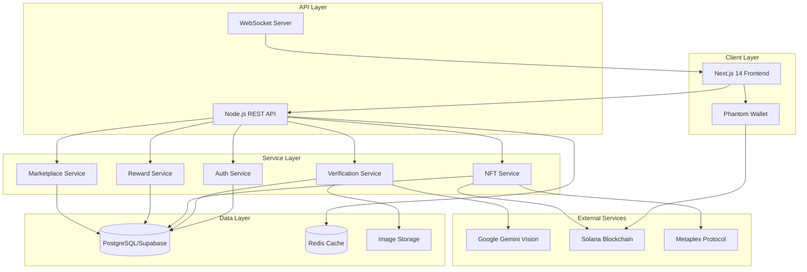

# Design Document

## Overview

Verdleaf is a full-stack Web3 application that combines AI verification, blockchain technology, and gamification to create an engaging eco-action platform. The system architecture follows a modern microservices approach with clear separation between frontend presentation, backend business logic, AI processing, and blockchain interactions.

The platform leverages Google Gemini Vision for image verification, Solana blockchain for NFT management and on-chain proof, PostgreSQL for relational data storage, and Next.js 14 for a responsive, animated user interface. The design prioritizes scalability, security, and user experience while maintaining the core principles of verifiable environmental impact.

## Architecture

### High-Level Architecture



### Technology Stack

**Frontend:**
- Next.js 14 (App Router, Server Components, Server Actions)
- TypeScript for type safety
- Tailwind CSS for styling
- Framer Motion for animations
- Solana Wallet Adapter for Web3 integration
- React Query for data fetching and caching

**Backend:**
- Node.js with Express.js
- Prisma ORM for database access
- PostgreSQL (hosted on Supabase)
- Redis for caching and session management
- WebSocket for real-time updates

**AI & Blockchain:**
- Google Gemini Vision API for image verification
- Solana Web3.js for blockchain interactions
- Metaplex SDK for NFT operations
- Anchor framework for smart contract interactions

**Infrastructure:**
- Vercel for frontend hosting
- Railway/Render for backend hosting
- Supabase for database and storage
- Cloudflare for CDN and DDoS protection

## Components and Interfaces

### 1. Authentication Service

**Responsibilities:**
- Wallet-based authentication using Phantom
- Session management and JWT token generation
- User profile creation and management

**Key Interfaces:**

```typescript
interface AuthService {
  connectWallet(publicKey: string, signature: string): Promise<AuthToken>;
  verifySession(token: string): Promise<User>;
  disconnectWallet(userId: string): Promise<void>;
  getUserProfile(userId: string): Promise<UserProfile>;
}

interface User {
  id: string;
  walletAddress: string;
  username?: string;
  createdAt: Date;
  lastLoginAt: Date;
}

interface AuthToken {
  accessToken: string;
  refreshToken: string;
  expiresIn: number;
}
```

### 2. Verification Service

**Responsibilities:**
- Process eco-action image submissions
- Interface with Gemini Vision API
- Calculate confidence scores and action types
- Assign EcoPoints based on verified actions

**Key Interfaces:**

```typescript
interface VerificationService {
  submitAction(userId: string, image: File, actionType: string): Promise<VerificationResult>;
  analyzeImage(image: File): Promise<AIAnalysis>;
  calculateEcoPoints(actionType: string, confidence: number): number;
  getVerificationHistory(userId: string): Promise<EcoAction[]>;
}

interface VerificationResult {
  actionId: string;
  verified: boolean;
  confidence: number;
  actionType: string;
  ecoPointsEarned: number;
  feedback?: string;
}

interface AIAnalysis {
  labels: string[];
  confidence: number;
  actionType: string;
  isEcoAction: boolean;
  reasoning: string;
}

interface EcoAction {
  id: string;
  userId: string;
  actionType: string;
  imageUrl: string;
  verified: boolean;
  confidence: number;
  ecoPoints: number;
  co2Offset: number;
  createdAt: Date;
}
```

### 3. NFT Service

**Responsibilities:**
- Mint initial EcoMon NFTs for new users
- Handle EcoMon evolution based on action count
- Mint collectible badge NFTs at milestones
- Update NFT metadata on-chain

**Key Interfaces:**

```typescript
interface NFTService {
  mintEcoMon(walletAddress: string): Promise<EcoMon>;
  evolveEcoMon(ecoMonId: string, newStage: EvolutionStage): Promise<EcoMon>;
  mintBadge(walletAddress: string, badgeType: BadgeType): Promise<Badge>;
  getEcoMon(walletAddress: string): Promise<EcoMon>;
  getBadges(walletAddress: string): Promise<Badge[]>;
}

interface EcoMon {
  id: string;
  mintAddress: string;
  walletAddress: string;
  stage: EvolutionStage;
  totalActions: number;
  attributes: EcoMonAttributes;
  imageUri: string;
  metadataUri: string;
}

enum EvolutionStage {
  SPROUTLING = 'SPROUTLING',
  BLOOMKIN = 'BLOOMKIN',
  FLORAZEN = 'FLORAZEN',
  TERRAVINE = 'TERRAVINE',
  GAIABLOOM = 'GAIABLOOM'
}

interface EcoMonAttributes {
  color: string;
  pattern: string;
  rarity: string;
  power: number;
}

interface Badge {
  id: string;
  mintAddress: string;
  walletAddress: string;
  type: BadgeType;
  earnedAt: Date;
  imageUri: string;
}

enum BadgeType {
  FIRST_STEPS = 'FIRST_STEPS',
  ECO_WARRIOR = 'ECO_WARRIOR',
  CARBON_CRUSHER = 'CARBON_CRUSHER',
  GREEN_GUARDIAN = 'GREEN_GUARDIAN',
  LEGENDARY_LEAF = 'LEGENDARY_LEAF'
}
```

### 4. Reward Service

**Responsibilities:**
- Track user EcoPoints balance
- Process EcoPoints transactions
- Calculate environmental impact metrics
- Generate impact statistics

**Key Interfaces:**

```typescript
interface RewardService {
  getBalance(userId: string): Promise<number>;
  addPoints(userId: string, points: number, reason: string): Promise<Transaction>;
  deductPoints(userId: string, points: number, reason: string): Promise<Transaction>;
  getImpactMetrics(userId: string): Promise<ImpactMetrics>;
  getTransactionHistory(userId: string): Promise<Transaction[]>;
}

interface Transaction {
  id: string;
  userId: string;
  amount: number;
  type: 'EARN' | 'SPEND';
  reason: string;
  balanceAfter: number;
  createdAt: Date;
}

interface ImpactMetrics {
  totalActions: number;
  totalEcoPoints: number;
  co2OffsetKg: number;
  treesPlantedEquivalent: number;
  waterSavedLiters: number;
  wasteReducedKg: number;
}
```

### 5. Marketplace Service

**Responsibilities:**
- Manage sustainable product listings
- Process EcoPoints purchases
- Verify vendor sustainability credentials
- Handle order fulfillment

**Key Interfaces:**

```typescript
interface MarketplaceService {
  listProducts(filters?: ProductFilters): Promise<Product[]>;
  getProduct(productId: string): Promise<Product>;
  purchaseProduct(userId: string, productId: string): Promise<Order>;
  getOrders(userId: string): Promise<Order[]>;
  verifyVendor(vendorId: string): Promise<VendorVerification>;
}

interface Product {
  id: string;
  name: string;
  description: string;
  ecoPointsPrice: number;
  category: string;
  vendorId: string;
  verified: boolean;
  impactMetrics: ProductImpact;
  imageUrl: string;
  stock: number;
}

interface ProductImpact {
  co2Saved: number;
  materialsRecycled: string[];
  certifications: string[];
}

interface Order {
  id: string;
  userId: string;
  productId: string;
  ecoPointsSpent: number;
  status: OrderStatus;
  createdAt: Date;
  fulfilledAt?: Date;
}

enum OrderStatus {
  PENDING = 'PENDING',
  PROCESSING = 'PROCESSING',
  SHIPPED = 'SHIPPED',
  DELIVERED = 'DELIVERED',
  CANCELLED = 'CANCELLED'
}
```

## Data Models

### Database Schema (Prisma)

```prisma
model User {
  id            String    @id @default(uuid())
  walletAddress String    @unique
  username      String?
  email         String?
  createdAt     DateTime  @default(now())
  lastLoginAt   DateTime  @default(now())
  
  ecoActions    EcoAction[]
  ecoMon        EcoMon?
  badges        Badge[]
  transactions  Transaction[]
  orders        Order[]
  
  @@index([walletAddress])
}

model EcoAction {
  id          String   @id @default(uuid())
  userId      String
  user        User     @relation(fields: [userId], references: [id])
  actionType  String
  imageUrl    String
  verified    Boolean  @default(false)
  confidence  Float
  ecoPoints   Int
  co2Offset   Float
  createdAt   DateTime @default(now())
  
  @@index([userId, createdAt])
  @@index([verified])
}

model EcoMon {
  id            String   @id @default(uuid())
  mintAddress   String   @unique
  userId        String   @unique
  user          User     @relation(fields: [userId], references: [id])
  stage         String
  totalActions  Int      @default(0)
  attributes    Json
  imageUri      String
  metadataUri   String
  createdAt     DateTime @default(now())
  updatedAt     DateTime @updatedAt
  
  @@index([userId])
  @@index([mintAddress])
}

model Badge {
  id          String   @id @default(uuid())
  mintAddress String   @unique
  userId      String
  user        User     @relation(fields: [userId], references: [id])
  type        String
  earnedAt    DateTime @default(now())
  imageUri    String
  
  @@index([userId])
  @@unique([userId, type])
}

model Transaction {
  id           String   @id @default(uuid())
  userId       String
  user         User     @relation(fields: [userId], references: [id])
  amount       Int
  type         String
  reason       String
  balanceAfter Int
  createdAt    DateTime @default(now())
  
  @@index([userId, createdAt])
}

model Product {
  id            String   @id @default(uuid())
  name          String
  description   String
  ecoPointsPrice Int
  category      String
  vendorId      String
  vendor        Vendor   @relation(fields: [vendorId], references: [id])
  verified      Boolean  @default(false)
  impactMetrics Json
  imageUrl      String
  stock         Int
  createdAt     DateTime @default(now())
  
  orders        Order[]
  
  @@index([category])
  @@index([verified])
}

model Vendor {
  id              String   @id @default(uuid())
  name            String
  verified        Boolean  @default(false)
  certifications  Json
  createdAt       DateTime @default(now())
  
  products        Product[]
}

model Order {
  id             String   @id @default(uuid())
  userId         String
  user           User     @relation(fields: [userId], references: [id])
  productId      String
  product        Product  @relation(fields: [productId], references: [id])
  ecoPointsSpent Int
  status         String
  createdAt      DateTime @default(now())
  fulfilledAt    DateTime?
  
  @@index([userId, createdAt])
  @@index([status])
}
```

## Correctness Properties

*A property is a characteristic or behavior that should hold true across all valid executions of a system—essentially, a formal statement about what the system should do. Properties serve as the bridge between human-readable specifications and machine-verifiable correctness guarantees.*


### Property Reflection

After reviewing all testable properties from the prework, several opportunities for consolidation emerge:

**Consolidations:**
- Properties 1.3 and 1.4 (confidence threshold approval/rejection) can be combined into a single property about confidence threshold behavior
- Properties 3.1 and 3.3 (evolution triggers and thresholds) can be combined into one comprehensive evolution property
- Properties 4.1 and 4.2 (badge minting and criteria) can be combined into a single badge milestone property
- Properties 8.1-8.4 are all UI feedback examples that don't need separate properties - they're implementation details
- Properties 11.1-11.4 are mobile-specific examples that are covered by responsive design principles

**Redundancies to eliminate:**
- Property 2.4 (display timing) is an implementation detail covered by general performance requirements
- Property 4.3 (celebration animation) is a UI detail, the important property is that badges are added to collections
- Property 8.5 and 11.5 (performance/smoothness) are subjective and not suitable for property-based testing

### Core Correctness Properties

**Property 1: Confidence threshold determines verification outcome**
*For any* verification result, if the confidence score is >= 95%, the action should be approved and recorded on-chain; if confidence < 95%, the action should be rejected with feedback.
**Validates: Requirements 1.3, 1.4**

**Property 2: EcoPoints calculation consistency**
*For any* verified eco-action of a given type and impact level, the EcoPoints calculation should always produce the same result.
**Validates: Requirements 1.5**

**Property 3: One EcoMon per wallet**
*For any* wallet address, attempting to mint multiple initial EcoMons should result in exactly one Sproutling NFT being created.
**Validates: Requirements 2.1, 2.5**

**Property 4: EcoMon metadata uniqueness**
*For any* two EcoMons minted, their visual attributes should be unique (different attribute combinations).
**Validates: Requirements 2.3**

**Property 5: Evolution stage matches action count**
*For any* EcoMon, its evolution stage should correctly correspond to its total verified actions: Sproutling (0-10), Bloomkin (11-30), Florazen (31-75), Terravine (76-150), Gaiabloom (151+).
**Validates: Requirements 3.1, 3.3**

**Property 6: Evolution updates on-chain metadata**
*For any* EcoMon evolution, the on-chain metadata should be updated to reflect the new stage and the query response should return the updated stage.
**Validates: Requirements 3.2, 3.5**

**Property 7: Badge minting at correct milestones**
*For any* user reaching action counts of 1, 25, 100, 250, or 500, the corresponding badge (First Steps, Eco Warrior, Carbon Crusher, Green Guardian, Legendary Leaf) should be minted exactly once.
**Validates: Requirements 4.1, 4.2, 4.5**

**Property 8: Badge collection completeness**
*For any* user profile query, all earned badges should be present in the response with their correct unlock dates.
**Validates: Requirements 4.4**

**Property 9: Purchase deducts correct EcoPoints**
*For any* product purchase, the user's EcoPoints balance should decrease by exactly the product's price, and the transaction should be recorded.
**Validates: Requirements 5.2, 5.3**

**Property 10: Marketplace displays verified products only**
*For any* marketplace query, all returned products should have verified status and include verification status, impact metrics, and pricing information.
**Validates: Requirements 5.1, 5.4, 5.5**

**Property 11: Dashboard metrics accuracy**
*For any* user, the dashboard should display metrics (total actions, CO2 offset, trees planted, EcoPoints) that accurately reflect the sum of all their verified eco-actions using standardized conversion rates.
**Validates: Requirements 6.1, 6.2**

**Property 12: Real-time dashboard updates**
*For any* newly verified action, querying the dashboard immediately after should return updated metrics that include the new action's impact.
**Validates: Requirements 6.4**

**Property 13: Authentication state consistency**
*For any* user session, protected features should be accessible only when wallet is connected, and disconnecting should clear session data and restrict access.
**Validates: Requirements 7.4, 7.5**

**Property 14: Admin metrics completeness**
*For any* admin dashboard query, the response should include all required metrics: active users, verification requests, system uptime, accuracy rates, and engagement statistics.
**Validates: Requirements 9.1, 9.2, 9.3**

**Property 15: Error logging with privacy**
*For any* system error, the error log should contain sufficient debugging context (error type, stack trace, timestamp) but should not contain personally identifiable information.
**Validates: Requirements 10.5**

**Property 16: Data encryption at rest**
*For any* sensitive user data stored in the database, the data should be encrypted using industry-standard algorithms (AES-256 or equivalent).
**Validates: Requirements 12.1**

**Property 17: Image retention policy**
*For any* eco-action image, the image should be deleted from storage within 30 days of verification completion.
**Validates: Requirements 12.3**

**Property 18: Data deletion preserves anonymized stats**
*For any* user data deletion request, all personally identifiable information should be removed, but aggregate impact statistics (total actions, CO2 offset) should remain in anonymized form.
**Validates: Requirements 12.5**

## Error Handling

### Error Categories and Strategies

**1. AI Verification Errors**
- **Timeout Errors**: If Gemini Vision API doesn't respond within 10 seconds, return a timeout error and allow retry
- **Low Confidence**: If confidence < 95%, provide specific feedback about why verification failed (e.g., "Image unclear", "No eco-action detected")
- **API Errors**: If Gemini API returns an error, log the error and display user-friendly message

**2. Blockchain Errors**
- **Transaction Failures**: Catch Solana transaction errors, explain the reason (insufficient SOL, network congestion), and offer retry
- **Wallet Connection Errors**: Handle wallet not installed, user rejection, and network mismatch scenarios
- **NFT Minting Errors**: If minting fails, rollback database state and notify user

**3. Database Errors**
- **Connection Failures**: Implement connection pooling and automatic retry with exponential backoff
- **Constraint Violations**: Catch unique constraint violations (duplicate badges, duplicate EcoMons) and handle gracefully
- **Transaction Rollbacks**: Use database transactions for multi-step operations and rollback on failure

**4. Network Errors**
- **Offline Detection**: Detect network connectivity loss and display offline indicator
- **Request Queuing**: Queue failed requests for automatic retry when connection is restored
- **Timeout Handling**: Set appropriate timeouts for all external API calls

**5. Validation Errors**
- **Input Validation**: Validate all user inputs on both client and server side
- **File Upload Validation**: Check file type, size, and format before processing
- **Business Logic Validation**: Validate sufficient EcoPoints before purchase, valid evolution stage before update

### Error Response Format

```typescript
interface ErrorResponse {
  error: {
    code: string;
    message: string;
    details?: any;
    retryable: boolean;
    suggestedAction?: string;
  };
}

// Example error codes
enum ErrorCode {
  VERIFICATION_TIMEOUT = 'VERIFICATION_TIMEOUT',
  INSUFFICIENT_CONFIDENCE = 'INSUFFICIENT_CONFIDENCE',
  WALLET_NOT_CONNECTED = 'WALLET_NOT_CONNECTED',
  INSUFFICIENT_ECOPOINTS = 'INSUFFICIENT_ECOPOINTS',
  TRANSACTION_FAILED = 'TRANSACTION_FAILED',
  NETWORK_ERROR = 'NETWORK_ERROR',
  VALIDATION_ERROR = 'VALIDATION_ERROR',
  INTERNAL_ERROR = 'INTERNAL_ERROR'
}
```

## Testing Strategy

### Unit Testing

**Framework**: Jest with TypeScript support

**Coverage Areas**:
- Service layer functions (verification logic, EcoPoints calculation, evolution triggers)
- Data validation functions
- Utility functions (metric conversions, date formatting)
- API route handlers
- Database query functions

**Example Unit Tests**:
- Test EcoPoints calculation for different action types
- Test evolution stage determination for various action counts
- Test badge unlock criteria
- Test error response formatting
- Test input validation functions

### Property-Based Testing

**Framework**: fast-check (JavaScript/TypeScript property-based testing library)

**Configuration**: Each property test should run a minimum of 100 iterations to ensure comprehensive coverage across the input space.

**Test Tagging**: Each property-based test must include a comment tag in this exact format:
```typescript
// **Feature: verdleaf-eco-companion, Property {number}: {property_text}**
```

**Coverage Areas**:
- Verification confidence threshold behavior (Property 1)
- EcoPoints calculation consistency (Property 2)
- One EcoMon per wallet invariant (Property 3)
- EcoMon attribute uniqueness (Property 4)
- Evolution stage correctness (Property 5)
- On-chain metadata updates (Property 6)
- Badge minting at milestones (Property 7)
- Purchase EcoPoints deduction (Property 9)
- Dashboard metrics accuracy (Property 11)
- Authentication state consistency (Property 13)
- Error logging privacy (Property 15)
- Data deletion anonymization (Property 18)

**Smart Generators**:
- Generate valid wallet addresses (Solana public keys)
- Generate eco-action types from predefined set
- Generate confidence scores between 0 and 100
- Generate action counts at boundary values (10, 11, 30, 31, etc.)
- Generate valid image files with various formats
- Generate user data with and without PII

### Integration Testing

**Framework**: Supertest for API testing, Playwright for E2E testing

**Coverage Areas**:
- Complete user flows (wallet connection → action submission → verification → reward)
- NFT minting and evolution flow
- Marketplace purchase flow
- Dashboard data aggregation
- Admin monitoring features

### Performance Testing

**Tools**: Artillery for load testing, Lighthouse for frontend performance

**Metrics**:
- AI verification response time (target: < 5 seconds)
- Dashboard load time (target: < 2 seconds)
- NFT minting time (target: < 10 seconds)
- API response time (target: < 500ms for most endpoints)
- Concurrent user handling (target: 1000+ simultaneous users)

### Security Testing

**Areas**:
- Authentication and authorization
- Input validation and sanitization
- SQL injection prevention (using Prisma parameterized queries)
- XSS prevention
- CSRF protection
- Rate limiting
- Wallet signature verification

## Implementation Phases

### Phase 1: MVP (Weeks 1-4)

**Core Features**:
- Wallet authentication with Phantom
- AI verification with Gemini Vision
- Basic EcoMon NFT minting (Sproutling only)
- EcoPoints tracking
- Simple dashboard

**Deliverables**:
- Working authentication flow
- Image upload and verification
- NFT minting on Solana devnet
- Basic UI with Tailwind CSS

### Phase 2: Gamification (Weeks 5-8)

**Core Features**:
- Full EcoMon evolution system (5 stages)
- Collectible badge NFTs
- Animated transitions with Framer Motion
- Enhanced dashboard with metrics
- Social sharing

**Deliverables**:
- Complete evolution mechanics
- Badge system
- Polished animations
- Impact visualizations

### Phase 3: Marketplace (Weeks 9-12)

**Core Features**:
- Sustainable product marketplace
- EcoPoints spending
- Vendor verification system
- Order management
- Product reviews

**Deliverables**:
- Working marketplace
- Payment processing with EcoPoints
- Vendor onboarding flow
- Order tracking

### Phase 4: Scale & Polish (Weeks 13-16)

**Core Features**:
- Mobile app (React Native)
- Admin dashboard
- Analytics and reporting
- Performance optimization
- Security hardening

**Deliverables**:
- Mobile apps (iOS/Android)
- Admin tools
- Production deployment
- Documentation

## Security Considerations

### Authentication & Authorization
- Use wallet signatures for authentication (sign message with private key)
- Implement JWT tokens with short expiration (15 minutes access, 7 days refresh)
- Store refresh tokens securely (httpOnly cookies)
- Implement role-based access control (user, admin, vendor)

### Data Protection
- Encrypt sensitive data at rest (AES-256)
- Use HTTPS for all communications
- Implement rate limiting (100 requests/minute per IP)
- Sanitize all user inputs
- Use Prisma ORM to prevent SQL injection

### Blockchain Security
- Verify wallet signatures before any state changes
- Use Solana program derived addresses (PDAs) for NFT authority
- Implement transaction simulation before submission
- Handle transaction failures gracefully
- Monitor for suspicious on-chain activity

### API Security
- Implement API key authentication for Gemini Vision
- Store API keys in environment variables
- Use request signing for sensitive operations
- Implement CORS policies
- Add request validation middleware

## Performance Optimization

### Frontend Optimization
- Use Next.js Server Components for initial page load
- Implement code splitting and lazy loading
- Optimize images with Next.js Image component
- Use React Query for efficient data caching
- Implement virtual scrolling for long lists

### Backend Optimization
- Use Redis for caching frequently accessed data
- Implement database connection pooling
- Use database indexes on frequently queried fields
- Implement pagination for large result sets
- Use background jobs for heavy processing (image analysis)

### Blockchain Optimization
- Use Metaplex compressed NFTs to reduce costs
- Batch transactions when possible
- Implement transaction priority fees for faster confirmation
- Cache on-chain data to reduce RPC calls
- Use Solana's getProgramAccounts efficiently

## Monitoring & Observability

### Metrics to Track
- User engagement (DAU, MAU, retention)
- Verification success rate and average confidence
- NFT minting success rate
- Transaction success rate
- API response times
- Error rates by category
- EcoPoints economy (earned vs spent)

### Logging Strategy
- Use structured logging (JSON format)
- Log levels: ERROR, WARN, INFO, DEBUG
- Include request IDs for tracing
- Log all verification attempts with outcomes
- Log all blockchain transactions
- Exclude PII from logs

### Alerting
- Alert on error rate > 5%
- Alert on API response time > 5 seconds
- Alert on verification success rate < 80%
- Alert on database connection failures
- Alert on blockchain transaction failures > 10%

## Deployment Strategy

### Infrastructure
- Frontend: Vercel (automatic deployments from main branch)
- Backend: Railway or Render (containerized deployment)
- Database: Supabase (managed PostgreSQL)
- Cache: Redis Cloud
- CDN: Cloudflare

### Environments
- **Development**: Local development with Solana devnet
- **Staging**: Staging environment with Solana devnet for testing
- **Production**: Production environment with Solana mainnet

### CI/CD Pipeline
1. Run linting and type checking
2. Run unit tests and property-based tests
3. Run integration tests
4. Build Docker images
5. Deploy to staging
6. Run E2E tests on staging
7. Manual approval for production
8. Deploy to production
9. Run smoke tests

### Rollback Strategy
- Keep previous 5 deployments available
- Implement feature flags for gradual rollout
- Monitor error rates after deployment
- Automatic rollback if error rate > 10%

## Future Enhancements

### Phase 5: Community Features
- User profiles and social connections
- Leaderboards and competitions
- Team challenges
- Community forums
- User-generated content

### Phase 6: Advanced Features
- DAO governance for platform decisions
- Carbon credit tokenization
- Corporate API for B2B integration
- Advanced AI features (action recommendations, impact predictions)
- Multi-chain support (Ethereum, Polygon)

### Phase 7: Global Impact
- Partnership with environmental organizations
- UN SDG alignment and reporting
- Impact verification by third parties
- Global tree planting initiatives
- Educational content and resources
